# Amazon Product Exploratory Data Analysis

## 📌 Project Overview

This project performs Exploratory Data Analysis (EDA) on an Amazon product dataset to identify patterns, trends, relationships, and important factors related to product pricing, discounts, ratings, and customer engagement.

The analysis uses Python, Pandas, Matplotlib, and Seaborn to clean the data, perform statistical analysis, create visualizations, and extract meaningful insights.

---

## 🎯 Objectives

- Understand the structure of the Amazon product dataset.
- Clean and preprocess numerical and categorical data.
- Analyze product prices and discounts.
- Study product ratings and rating counts.
- Identify relationships between price, discount, ratings, and reviews.
- Compare different product categories.
- Identify highly reviewed products.
- Analyze correlations between numerical variables.
- Present findings through clear visualizations.

---

## 📊 Dataset

The dataset contains information about Amazon products, including:

- Product ID
- Product Name
- Category
- Discounted Price
- Actual Price
- Discount Percentage
- Rating
- Rating Count
- Product Description
- User Information
- Reviews
- Product and Image Links

### Dataset Size

- **Rows:** 1,465
- **Original Columns:** 16

---

## 🛠️ Technologies Used

- Python
- Pandas
- NumPy
- Matplotlib
- Seaborn
- Jupyter Notebook

---

## 🔄 Project Workflow

1. Import required libraries
2. Load the dataset
3. Understand dataset structure
4. Check missing values
5. Check duplicate records
6. Convert numerical columns into appropriate data types
7. Perform feature engineering
8. Generate statistical summaries
9. Analyze product categories
10. Analyze prices and discounts
11. Analyze ratings and reviews
12. Study relationships between variables
13. Perform correlation analysis
14. Generate visualizations
15. Extract key insights

---

## 🧹 Data Preprocessing

The following preprocessing steps were performed:

- Removed currency symbols from price columns.
- Removed commas from numerical values.
- Converted price values to numeric format.
- Converted discount percentages to numeric values.
- Converted ratings to numeric values.
- Converted rating counts to numeric values.
- Checked and handled missing values.
- Checked duplicate records.

---

## ⚙️ Feature Engineering

Two additional features were created:

### Amount Saved

Calculated as:

`Amount Saved = Actual Price - Discounted Price`

### Main Category

The first category from the hierarchical category column was extracted for easier category-level analysis.

---

## 📈 Exploratory Data Analysis

### 1. Product Category Distribution

Shows the distribution of products across the major Amazon categories.

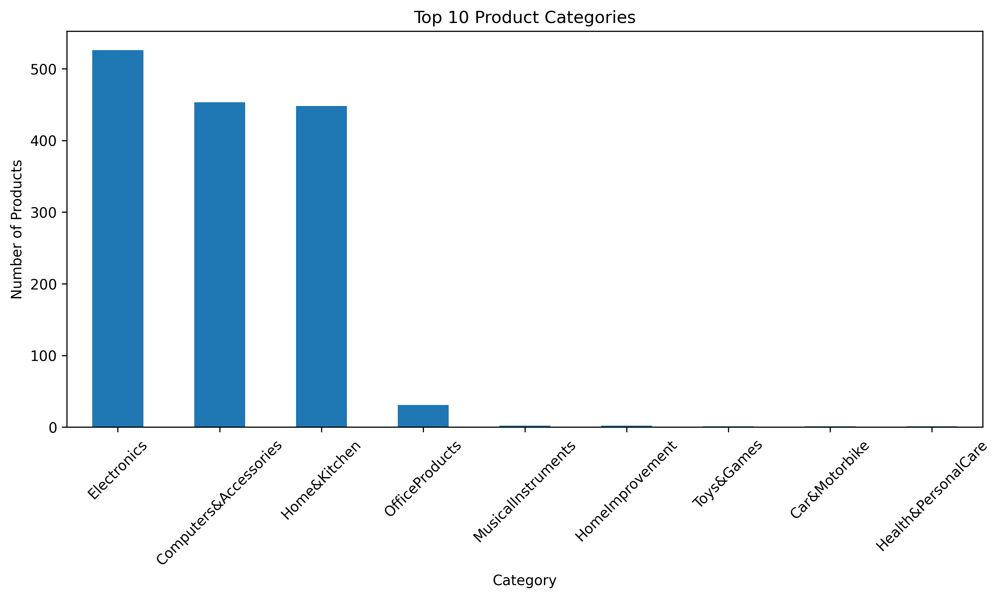

---

### 2. Discounted Price Distribution

Shows how discounted product prices are distributed across the dataset.

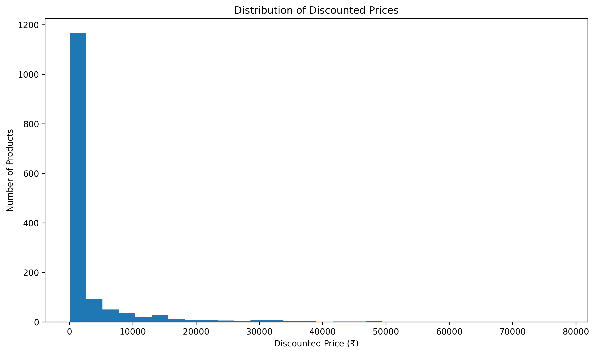

---

### 3. Discount Percentage Distribution

Shows the distribution of discounts offered on Amazon products.

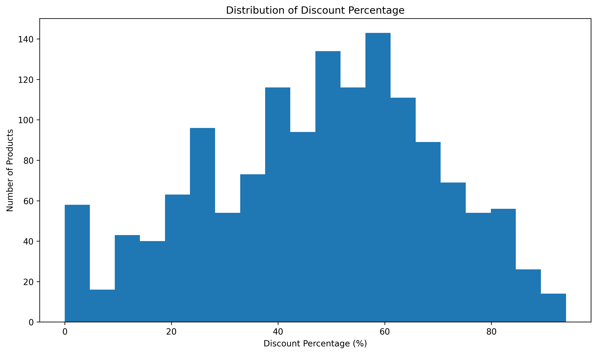

---

### 4. Product Rating Distribution

Shows the distribution of customer ratings across products.

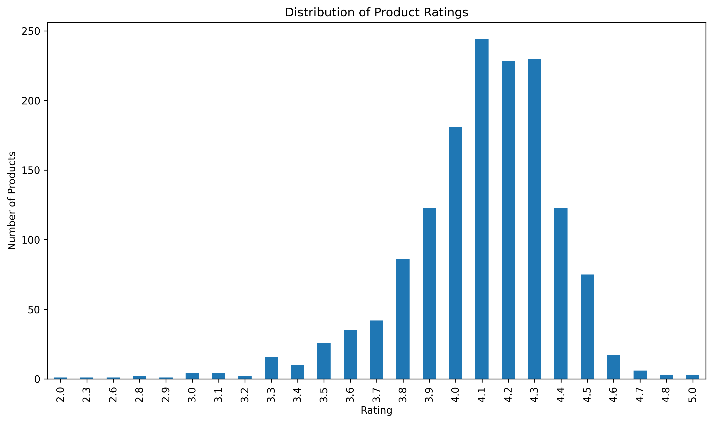

---

### 5. Price vs Rating

Examines whether product price has any noticeable relationship with customer ratings.

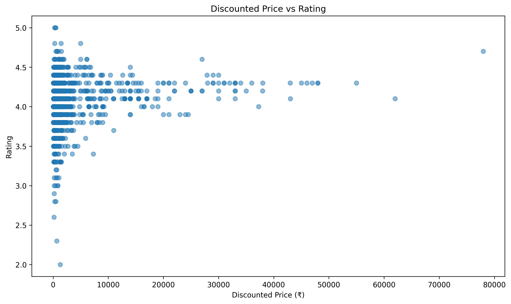

---

### 6. Discount vs Rating

Examines the relationship between discount percentage and product ratings.

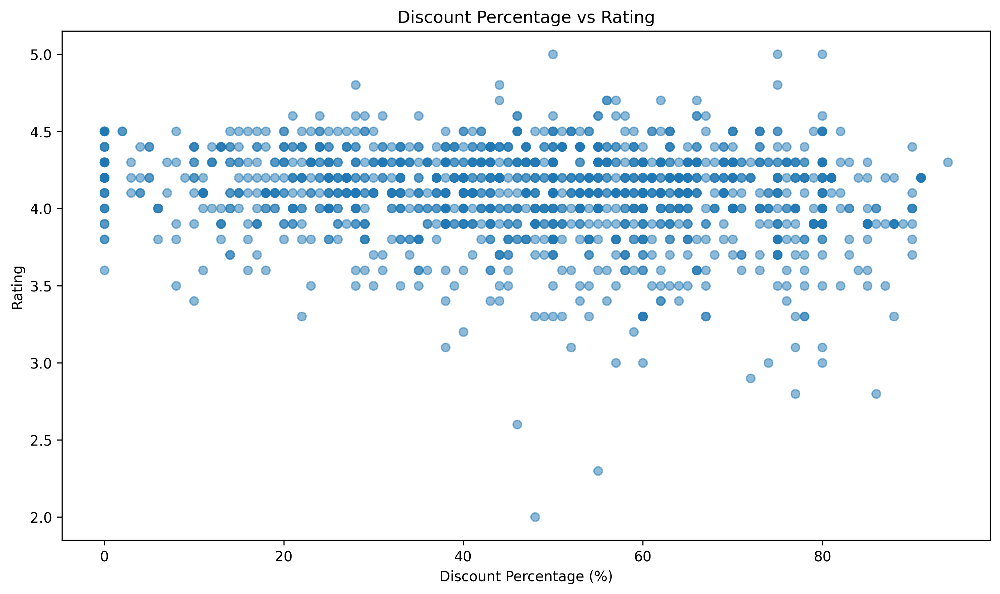

---

### 7. Rating Count vs Rating

Analyzes the relationship between the number of ratings and the average product rating.

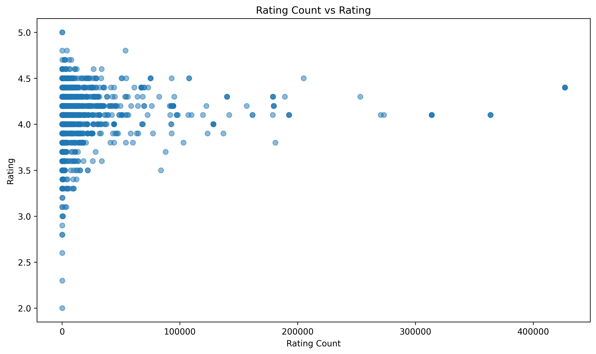

---

### 8. Average Discount by Category

Compares the average discount percentage across major product categories.

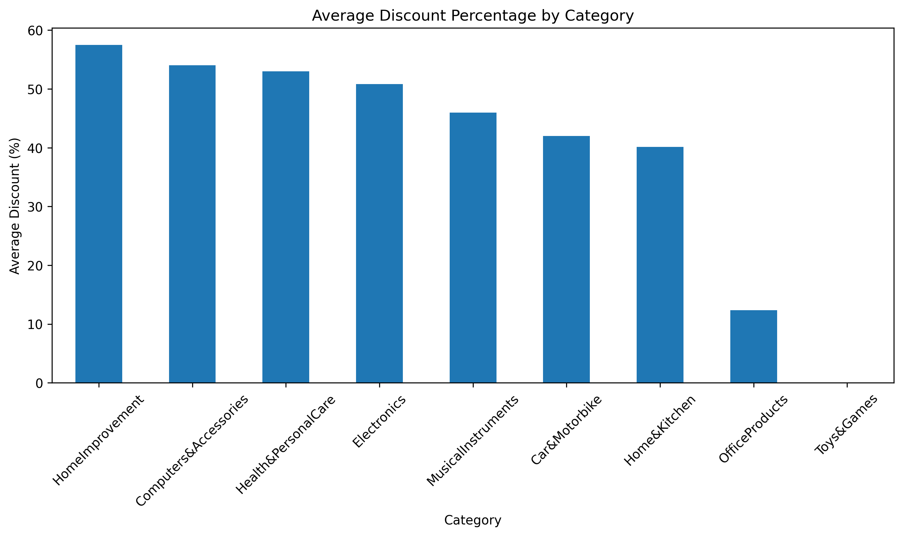

---

### 9. Average Rating by Category

Compares average customer ratings across different product categories.

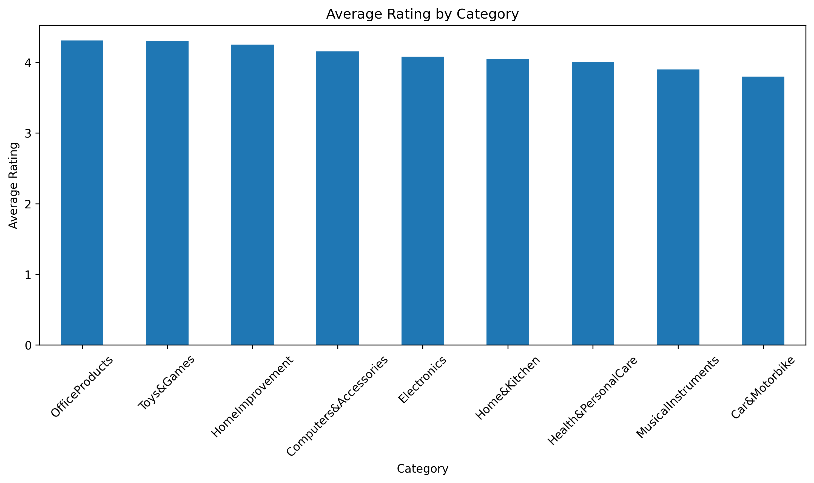

---

### 10. Correlation Heatmap

Shows correlations between numerical variables such as price, discount, rating, rating count, and amount saved.

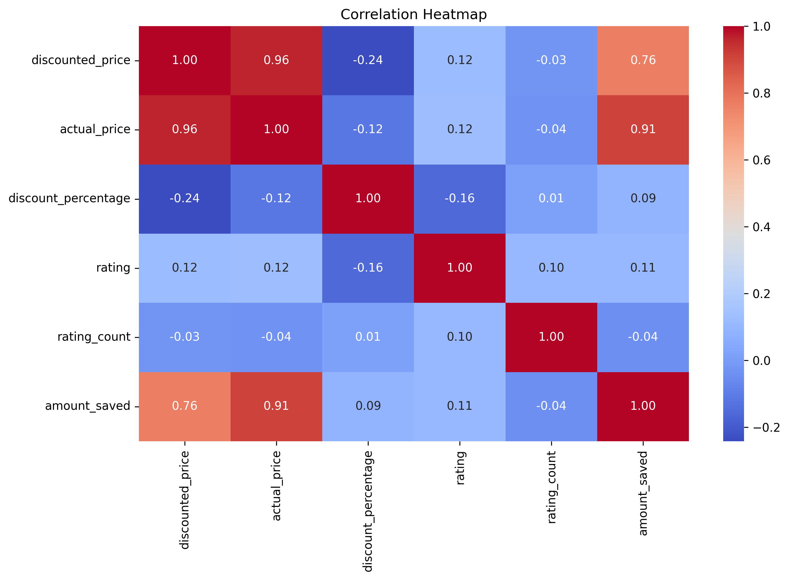

---

### 11. Top 10 Most Reviewed Products

Shows the products receiving the highest number of customer ratings.

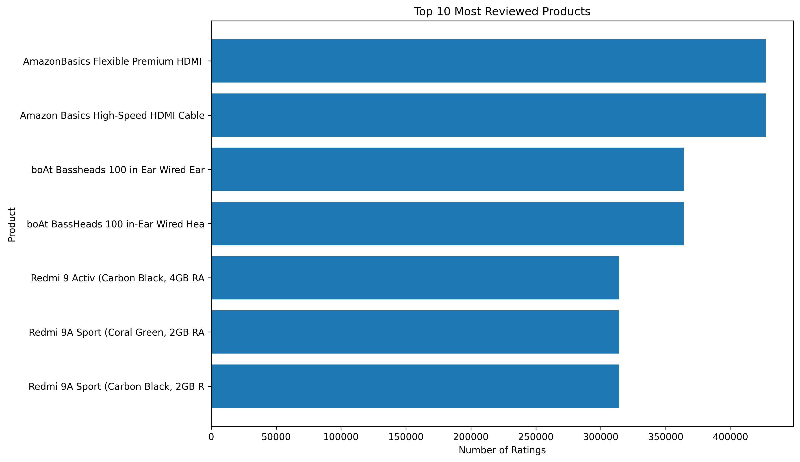

---

## 🔍 Key Analytical Questions

The analysis focuses on questions such as:

- Which categories contain the most products?
- How are product prices distributed?
- What discount percentages are most common?
- What ratings are most frequently given?
- Does product price appear to influence ratings?
- Does a higher discount correspond to better ratings?
- Which products have the highest number of reviews?
- Which categories have the highest average discounts?
- Which categories have the highest average ratings?
- Which numerical variables have strong correlations?

---

## 💡 Key Insights

The EDA helps identify:

- Distribution of products across different categories.
- Common price and discount ranges.
- Overall customer rating patterns.
- Highly reviewed products.
- Differences in discounts and ratings between categories.
- Relationships between pricing, discounts, ratings, and customer engagement.
- Important correlations among numerical variables.

These insights can help understand product performance and customer behavior on an e-commerce platform.

---

## 📁 Project Structure

```text
amazon-product-eda/
│
├── data/
│   └── amazon.csv
│
├── notebooks/
│   └── Amazon_EDA.ipynb
│
├── visualizations/
│   ├── category_distribution.png
│   ├── price_distribution.png
│   ├── discount_distribution.png
│   ├── rating_distribution.png
│   ├── price_vs_rating.png
│   ├── discount_vs_rating.png
│   ├── rating_count_vs_rating.png
│   ├── category_discount.png
│   ├── category_rating.png
│   ├── correlation_heatmap.png
│   └── top_reviewed_products.png
│
├── README.md
├── requirements.txt
└── .gitignore
